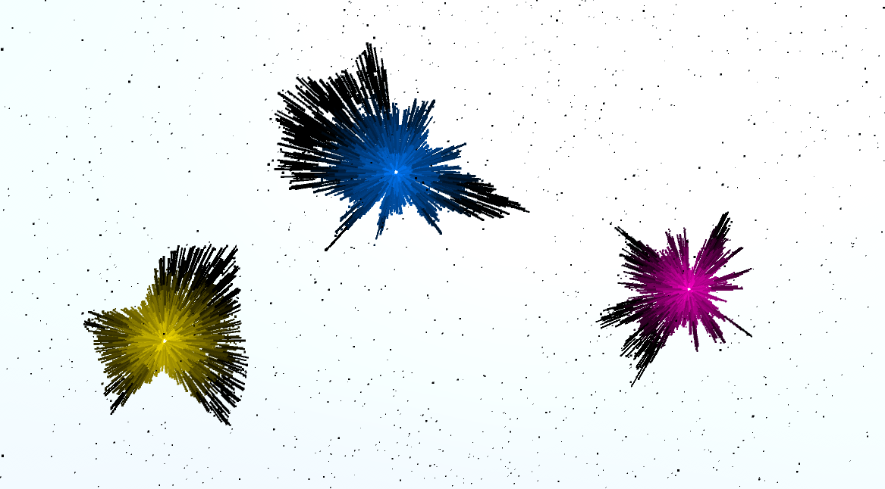

# Planeterium Project

## Project Outline
This project contains a unity file for graphics of a proposed event. The event space will have a large screen projecting the game scene of the unity file. The concept is a planetarium filled with stars that represent visitor’s angel numbers. Visitors will be able to create a star by inputting their angel number into an external application, and a unique star will be created by a deterministic algorithm, and presented on the game scene. 

In the unity project file, navigate to Scenes -> Planetarium and enter game mode to see the main graphics for the proposed event. 

Run the Planeterium_Client java file with
java PlaneteriumClient <star index (0-2)> <seed>

This will update a star in the unity game scene

## High Level Overview
SystemControl.cs starts a server accepting incoming requests containing a json object with 2 fields, a star index and a seed. On request, the blob generation method in BlobGenerator.cs is called to create a new blob texture based on the seed. Using a murmur hash function, the seed is remapped and used to deform a circle to create a blob texture. SystemControl.cs updates the star defined by the request with this new boundary texture to create a new star shape.  
